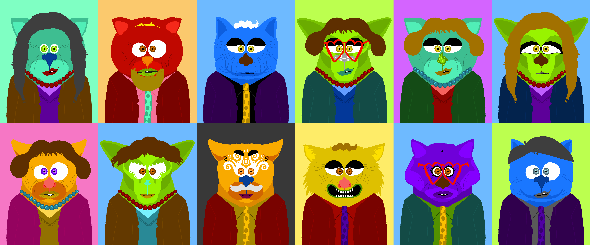
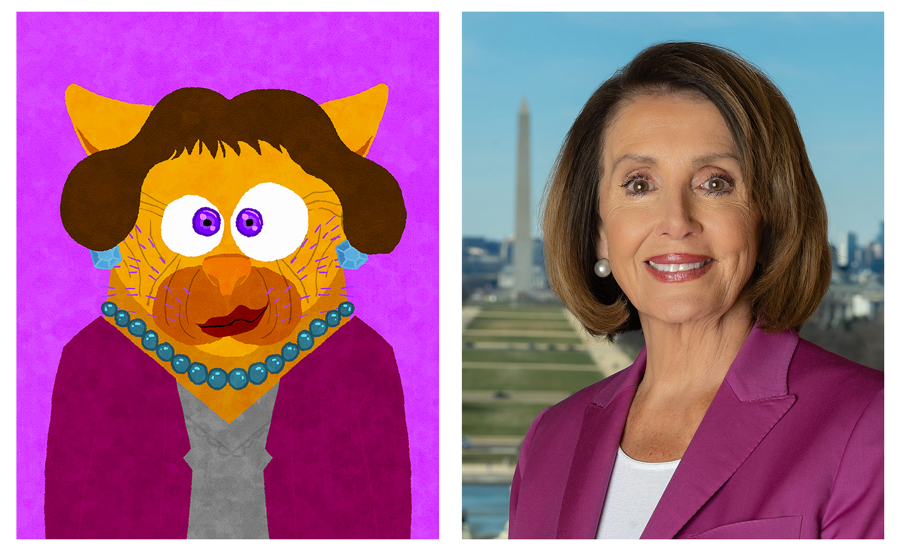
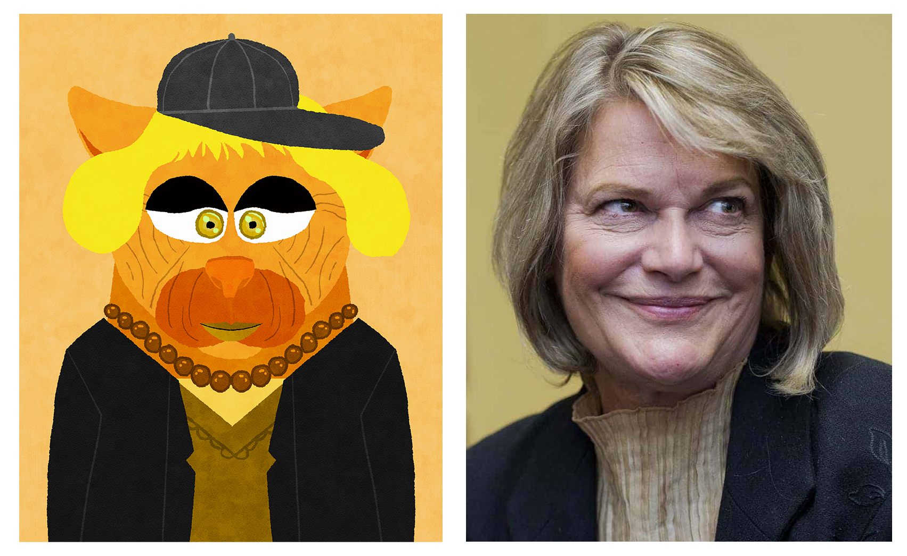

# PHATCAT
## by PAC DAO

At a time when cryptocurrency is coming under direct assault, we're proud to release PHATCAT, a generative art NFT representing each Member of the 117th session of the United States Congress, to raise funds to support legal defense of cryptocurrency issues.

## PHATCAT

PHATCAT NFTs are a generative art celebration of all [Members of Congress for the 117th legislative session](https://en.wikipedia.org/wiki/117th_United_States_Congress).

One of [PAC DAO](https://pac.xyz/)'s launch promises was to collect a publicly sourced scorecard representing the pro-crypto or anti-crypto sentiment for each Member of Congress.  For a year we have been crowdsourcing opinions on legislator's advocacy towards cryptocurrency.  In PHATCAT we etch these results eternally on-chain.  We received over 2000 votes from 100 distinct wallet addresses, providing a great snapshot of sentiment.  This data will provide an immutable guide for voters as they go to the polls and a great historical record of these troubled times. 

The announced utility of the NFT is to allow the bearer to edit some metadata.  Through the 2022 election we’ll be hosting a page for each Member of Congress with their scoring history and any associated commentary.  NFT holders will be able to edit some optional metadata, allowing challengers to redirect to their own site for instance.

Note the DAO reserves the capability to override changes to the metadata — we can’t predict the outcome of DAO votes, but we’d expect the DAO would reserve this power for extreme cases like illegal material.  

This is built out in the spirit of good fun, a good-natured way to celebrate the many great Congresspeople who took a stand in favor of cryptocurrency, protecting America from odious acts like the insertion of the cryptocurrency provisions into the infrastructure bill that united the crypto community.

## Mechanics

Bidding on any eligible seat triggers an auction.  Auctions last for a fixed duration after any user makes a bid.  Auctions bids must be made in units of .01 ETH to prevent dust attacks.  Losing bidders may withdraw their money after the auction ends.

Any seat not claimed or up for auction are eligible to be claimed by minting a pseudo-random batch at a fixed price.

We launching with the following values:

 * **Price to Mint a Seat at Random:** 0.1 ETH per seat
 * **Auction Duration:** 24 hours after last bid
 * **Min Units of Auction Bids:** .01 ETH

Why did we choose such a unique mechanic?  Read on…

## Economics

Economically, maximizing the minting mechanics for every Member of Congress is a complex problem.  

A handful of seats, like notable pro-crypto or anti-crypto advocates, may be considered more valuable.  We expect an Elizabeth Warren NFT to have considerable interest, but most are only known in their districts (if at all).

Further complicating things is that we don’t know the theoretical optimum price for each seat.  We can guess that a rare Nancy Pelosi seat may fetch a higher price, but a common Congressperson may not even trigger an auction at all.

One possible mint mechanic would be to allow users to mint a pack.  This evokes the fun of opening a pack of baseball cards and hoping you get a rare one.  However, in the event the mint price is too low, this leaves considerable money on the table for a rare card that may have fetched a higher price.

Another mint mechanic would be a series of several hundred auctions.  However, NFT fans may not have interest in even opening an auction on lesser known seats.

We opted therefore for a blended approach.  Any user may trigger an auction on any unclaimed seat.  This allows users to get some guarantee they’ll have a shot at a seat they may consider valuable.  We also achieve optimum price discovery for these seats.

Alternately, users may purchase a pseudorandom pack of unclaimed cards for a set price.  This can allow bargain hunters to try for a shot at minting a rare card for a low fixed price.  Any seat already put to auction is excluded.  The DAO has the capability of adjusting this price as the mint proceeds, so the DAO may opt to raise or lower prices depending on the community’s assessment of the rarity of remaining seats.

What will actually happen?  We’ll have to see!

## Artwork Notes

For our Member of Congress NFTs, we returned to Rebecca Hendin, who helped produce several of our initial NFTs.

We were able to uniquely distinguish Congresspeople by breaking them into about a dozen dimensions, things like hairstyle, color, mouth, et al.  We added a few additional traits tossed in for rarity.  We assigned these categories manually, many thanks to everybody who helped proofread these.

We added a few additional constraints to our script when generating art for the Congresspeople:

We applied a color threshold based on party — Democrats could not have a color profile tilting too red, Republicans not too blue.

Although we distributed facial expressions randomly throughout, we increased the likelihood of generating a negative sneer if the Congressperson had a very negative score.

Some additional notes

 * 6 pro-crypto Members of Congress were awarded a special *crypto cap* as thanks for their efforts
 * The most anti-crypto Member of Congress was given sunglasses, since they have difficulty seeing the future
 * 17 well known legislators were granted "rare" status, with custom artwork and a special texture to designate the difference
 * Additional random traits scattered throughout.
 
 
 

*Senator Cynthia Lummis received a crypto cap for her exemplary support of cryptocurrency*

## Technical Notes

The contracts, tests, and generative art scripts are available in the Github repository for all to review the methodology or utilize freely in your own NFT projects

We implemented this Contract as the second known Vyper NFT.  Vyper NFTs as a baseline are more gas efficient than their Solidity default.  They are also far more readable, meaning the publicly viewable codebase is open for users who want to fork the code and produce similar projects.  Of particular interest may be the pseudo-random code generation, and the use of gas-inefficient megaviews for frontend views.

Contract Addresses:
 * [Minter](https://etherscan.io/address/0x54ffc76838e79e7fd9aa52fbdc49f2671743d305)
 * [NFT](https://etherscan.io/address/0x7aec433a4c4bd251761c7f81ef92ee0025e27685)

## License

This project is licensed under the [MIT license](LICENSE).
